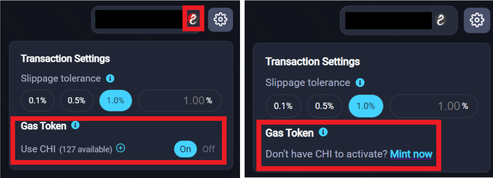

FAQ: Most common things asked / stuff that you need to know.

---

## Q: What is Basis Dollar?

Basis Dollar (BSD) is an algorithmic stablecoin that is intended to tend towards $1 over a long period of time.
Intended: No guarantees that it will.

Over a long period of time: There may be short-term volatility.

Basis Dollar consists of 3 tokens:

- BSD: The stablecoin itself
- Basis Dollar Shares (BSDS): Effectively, a fixed supply stake in the protocol, which is entitled to BSD issuance during periods of expansion.
- Basis Dollar Bonds (BSDB): Soaks up BSD from the market during periods of contraction, in return for a premium when the peg returns to $1 (and above).

## Q: How does it compare with Basis Cash, AMPL, ESD, DSD?

**How does it compare with Basis Cash?** The project is based on Basis Cash with several changes implemented to it. These are discussed below, and highlighted on the very first page of https://docs.basisdollar.fi/ so please, please read that.

The key differences include the frequency of checks per day (2x, compared to Basis Cash at 1x), use of 2 price oracles (not 1, as Basis Cash is using only DAI), cap on size of expansion, cap on debt, and so forth.

Please read the Basis Dollar documentation and compare it with the Basis Cash documentation at https://docs.basis.cash/

**How does it compare with AMPL?** Ampleforth is a single token system. Ampleforth uses expansion & contraction of that single token to incentivize players to stabilize AMPL towards $1.

**How does it compare with ESD, DSD?** Both of these are 2 token systems. ESD and DSD are the stablecoin itself, while there is an additional debt token (coupon) used to stabilize ESD/DSD towards $1.

## Q: What time does each epoch start and end?

2 times:
• 00:00 UTC time
• 12:00 UTC time

> Pro tip: Set an alarm on your phone or calendar if you need to remind yourself to take actions around the end or beginning of an epoch.

## Q: What is the total supply & circulating supply of BSD?

It is right on the home page at https://basisdollar.fi/

The total supply of BSD expands / contracts depending on where BSD is relative to the peg of $1. The formula for expansion can be found at https://docs.basisdollar.fi/ProtocolParameters
During the 1st 14 epochs, there is 9% expansion of BSD per epoch.

BSD’s token contract address is https://etherscan.io/token/0x003e0af2916e598fa5ea5cb2da4edfda9aed9fde This is where you can find the total supply.

The circulating supply subtracts the following from total supply:

- BSD staked in the BSD/DAI pool https://etherscan.io/address/0xc1b6296e55b6ca1882a9cefd72ac246acde91414
- BSD staked in the BSD/USDC pool https://etherscan.io/address/0xcdd2bd61d07b8d42843175dd097a4858a8f764e7
- BSD rewards in the Seed bank farms https://etherscan.io/address/0xa249ee8255df0aa00a15262b16bca3efd66c3e4c
- BSD rewards in the Seignorage stake farm https://etherscan.io/address/0xb9fb8a22908c570c09a4dbf5f89b87f9d91fbf4a
- BSD rewards for dissemination (for each of the ValueLiquid farms)
  - https://etherscan.io/address/0x71661297e9784f08fd5d840d4340c02e52550cd9
  - https://etherscan.io/address/0x9e7a4f7e4211c0ce4809ce06b9dda6b95254baac
  - https://etherscan.io/address/0xe0e7f7eb27cebcdb2f1da5f893c429d0e5954468
  - https://etherscan.io/address/0xc259bf15bad4d870dff1fe1aab450794eb33f8e8

## Q: What is the total supply & circulating supply of BSDS?

It is right on the home page at https://basisdollar.fi/

The total supply of BSDS is fixed at 1,000,001.
There is 200k BSDS of which 100k BSDS is allocated to the team and another 100k BSDS is allocated to the DAO fund. This 200k BSDS vests linearly over 1 year.
So, the total supply of BSDS at the outset of the project is 800,001.

Because vesting has already started, the current total supply is https://etherscan.io/token/0xE7C9C188138f7D70945D420d75F8Ca7d8ab9c700

The circulating supply subtracts the following from total supply:

- BSDS staked in the Seignorage stake farm https://etherscan.io/address/0xb9fb8a22908c570c09a4dbf5f89b87f9d91fbf4a
- BSDS staked in the BSDS/DAI pool https://etherscan.io/address/0xdd82e4227baec1fc40a72ef9895f38f2c1df4f42
- BSDS staked in the BSDS/USDC pool https://etherscan.io/address/0x8438d64da58772e9f7fceaa1506ba300f935abbd
- BSDS rewards for dissemination (for each of the ValueLiquid farms)
  - https://etherscan.io/address/0x71661297e9784f08fd5d840d4340c02e52550cd9
  - https://etherscan.io/address/0x9e7a4f7e4211c0ce4809ce06b9dda6b95254baac
  - https://etherscan.io/address/0xe0e7f7eb27cebcdb2f1da5f893c429d0e5954468
  - https://etherscan.io/address/0xc259bf15bad4d870dff1fe1aab450794eb33f8e8

## Q: Where can I find the price/volume data of BSD and BSDS?

For BSD, you can find price & volume data, including transaction history at https://valueliquid.info/token/0x003e0af2916e598fa5ea5cb2da4edfda9aed9fde

For BSDS, you can find price & volume data, including transaction history at https://valueliquid.info/token/0xe7c9c188138f7d70945d420d75f8ca7d8ab9c700

You can also use Coingecko to find broader market data

- https://www.coingecko.com/en/coins/basis-dollar
- https://www.coingecko.com/en/coins/basis-dollar-share

## Q: How do you calculate APR?

APR is a function of Value of rewards emitted divided by Value of staked assets.
For the rewards value, this is a function of the emission rate of the reward token (whether BSD or BSDS), and the price of the aforementioned reward token.
For the staked assets value, this is a function of the assets contributed in total to the pool, whether:

- Stablecoins to the Seed Bank during the 1st 4 weeks,
- BSDS to the Seignorage Stake farm, or
- A combination of BSD, BSDS, DAI, USDC to the various farms in Share Bank.

## Q: Is the APR guaranteed? Will it change?

It is definitely not guaranteed. In fact, the only thing that is guaranteed is that it will be volatile and change continuously. As per above, the rewards value and staked assets value can change at any time and that will affect your APR calculations.

## Q: Is there a lockup when staking?

There is a 4 epoch (48 hours, 2 days) lockup for staking BSDS in Seignorage Stake. While there is a 2 epoch (24 hours, 1 day) lockup for claiming rewards in Seignorage Stake, please be aware that claiming any rewards results in the lockup timer being reset.
There is no lockup for staking in the farms listed in the Seed Bank and the Shares Bank.

## Q: Where do we swap our rewards?

For swaps of BSD and BSDS to USDC or DAI, we are using [Value Liquid][vl] not Uniswap.
People are free to set up or use Uniswap pools, but please take note there are no incentivized pools for Uniswap. Furthermore, you run the risk of transacting on fake tokens on Uniswap. With ValueLiquid, tokens are vetted before listing on the ValueLiquid platform.

> Pro Tip: If you want to swap your farmed BSD into BSDS or BSDS into BSD, you can do so using the Swap function. You don’t have to swap into DAI or USDC then execute another tx. Do it all in one tx.
> Pro Tip: Slippage is different between pools, so always check the price impact and make your decision accordingly.

## Q: Why did you choose ValueLiquid?

ValueLiquid has farm-as-a-service which also has certain benefits for its users. For example, whenever you deposit or withdraw from the farms, it automatically claims your rewards for you. You don’t need a separate transaction.

Don’t panic if your rewards seem to disappear, please go check your ETH address, I promise you will see your rewards there!

> Pro Tip: Use ValueLiquid efficiently. Always enable usage of the CHI gas token.
> Before you do anything, learn more about the gas token here:
> https://1inch-exchange.medium.com/1inch-introduces-chi-gastoken-d0bd5bb0f92b >https://1inch-exchange.medium.com/everything-you-wanted-to-know-about-chi-gastoken-a1ba0ea55bf3

Look at the top right hand side corner of [Value Liquid][vl] You should be able to see a settings button. Press it, and you will have the option to activate the Gas Token. Press “ON”. If you don’t have any gas tokens, you can either mint them now, or purchase them at [mooniswap][m01]

## Q: I don’t want to farm BSD or BSDS. I want to buy them quick, and I am too lazy to search for them on ValueLiquid. What is the link?

As noted above, you should go to [Value Liquid][vl] and swap them there accordingly.
However, if you want the links, they are here.

Swap to BSD: [valueliquid.io][vl01]

Swap to BSDS: [valueliquid.io][vl01]

[//]: # "reference"
[vl]: https://valueliquid.io
[m01]: https://mooniswap.exchange/#/swap
[vl01]: https://valueliquid.io/#/swap?inputCurrency=0xe7c9c188138f7d70945d420d75f8ca7d8ab9c700
[vl02]: https://valueliquid.io/#/swap?inputCurrency=0x003e0af2916e598fa5ea5cb2da4edfda9aed9fde
